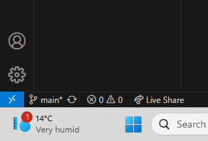

# 716.E.T
This repository details the code for modelling ET in the model of ET look.  This repository was created by the GIT 716 Honors class of 2023
heklo
# Tech Stack 
- Visual Studio code
- GitHub 

# Create your python environment using Conda
- Open VS code 
- Shift + Ctrl + P to open the command paallet
- Search for Python: Create environment 
- Select conda 
- Select the latest version of Python available

# Setting up your environment in VS code or Pycharm 
- Open the command pallet again.
- search for clone and enter the following URL: https://github.com/zainof/716.E.T.git
- Once you have cloned the repo, switch to your branch before you start coding
- Look at the bottom left  and click on main 
- The command pallet should show up at the top
- click on you name, the branch name should change
- After this then you can start editing and making changes to the code
- When you are done make sure you commit the changes to your branch only
- committing to main may cause conflicts 

# Idea for execution 
- each person will work on their own branch from which they will be able to edit and make changes to the code and not affect the other peoples work. This will allow us to work on different sections or part of the code simultaneously. 
